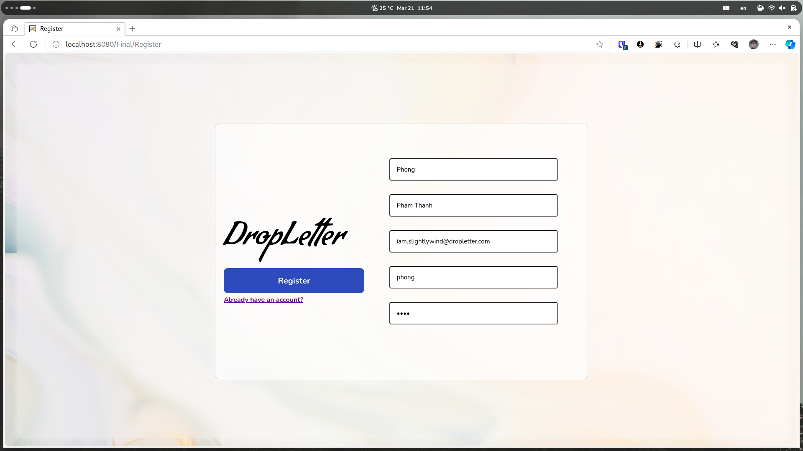
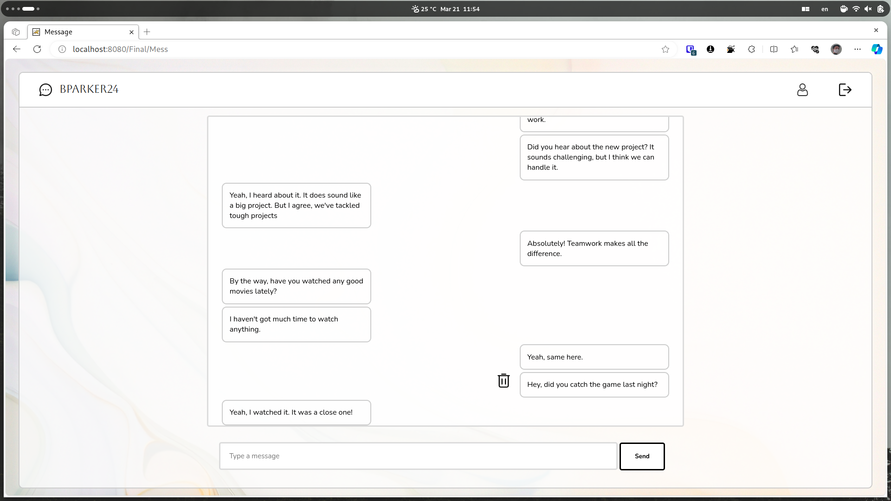

# Dropletter

Dropletter is a user-friendly messaging app designed to streamline communication among multiple users. Here are its key features:

- User Authentication: Login functionality ensures user privacy.
- Registration: New users can easily register for an account to join the messaging platform.
- Account Management: Users have the flexibility to modify their account details, including first and last names, and passwords. They also have the option to delete their accounts if needed.
- User Search: Convenient search functionality allows users to find and connect with other users on the platform.
- Friend Management: Users can effortlessly request to add and remove friends from their contact list.
- Messaging: Seamlessly exchange messages with friends. Users can also delete messages to manage their conversations efficiently.
- Search: Introducing a friend request system. Users can send friend requests to connect with others on the platform. They have the option to retract sent requests or accept incoming requests from other users.

Dropletter simplifies the messaging experience, offering a reliable platform for efficient communication.

## Preview

